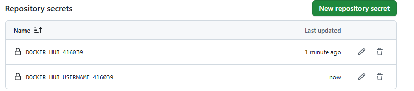
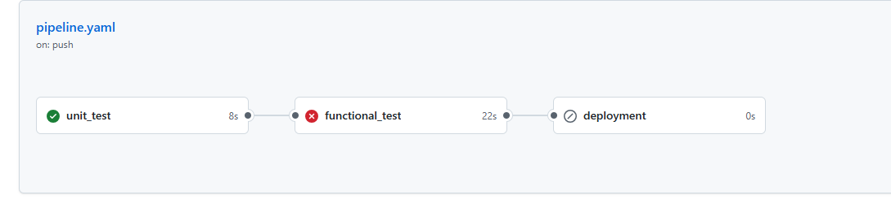
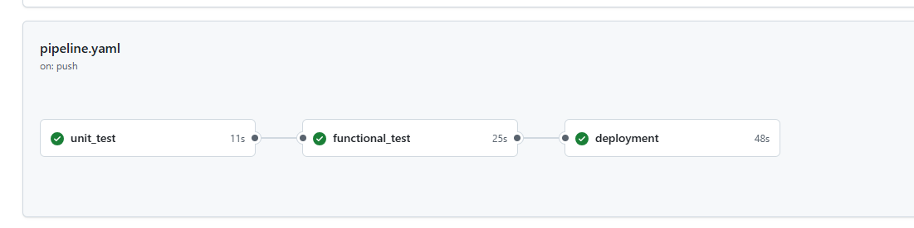
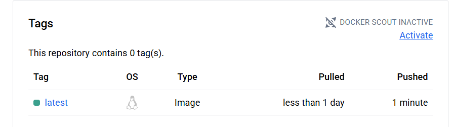
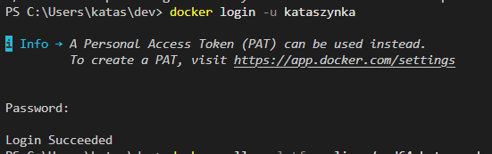

# Git action deployment pipeline - Sprawozdanie

### **1. Aktualizacja repozytorium i utworzenie branchu**

### **2. Utworzenie konta i repozytorium na Docker Hub**


### 3. Utworzenie tokenu dostępowego


Skopiowałam token i zapisałam lokalnie.


### **4. Utworzenie sekretu GitHub**


Utworzyłam dwa sekrety (token i username):

 `DOCKER_HUB_416039`,
 `DOCKER_HUB_USERNAME_416039`



### **5. Utworzenie środowiska roboczego**


### **6. Konfiguracja GitHub Actions**
- Utworzenie 3 jobow

Kod pipeline:
```yaml
name: lab_8_416039
on:
  push:
    branches:
      - lab8/416039
jobs:
  unit_test:
    runs-on: ubuntu-latest
    steps:
      - name: Checkout code
        uses: actions/checkout@v2
      - name: Set up Python
        uses: actions/setup-python@v2
        with:
          python-version: "3.11"
      - name: Install libs for testing
        run: |
          pip  install pytest 
      - name: prepare environemnt
        run: |
          cd ./Lab_8/env_416039 && python -m pip install -r requirements.txt
      - name: Run test
        run: |
          cd ./Lab_8/env_416039/main && pytest calculator_test.py
  functional_test:
    runs-on: ubuntu-latest
    needs: unit_test
    steps:
      - name: Checkout code
        uses: actions/checkout@v2
      - name: Set up Python
        uses: actions/setup-python@v2
        with:
          python-version: "3.11"
      - name: Install libs for testing
        run: |
          pip  install pytest 
      - name: prepare environemnt
        run: |
          cd ./Lab_8/env_416039 && python -m pip install -r requirements.txt
      - name: Run app
        run: |
          cd ./Lab_8/env_416039/main && nohup python app.py &
      - name: Wait for app
        run: |
          sleep 10
      - name: Run test
        run: |
          cd ./Lab_8/env_416039/main && pytest app_test.py
  deployment:
    runs-on: ubuntu-latest
    needs: functional_test
    steps:
      - name: Checkout code
        uses: actions/checkout@v2
      - name: Login to DockerHub
        uses: docker/login-action@v1
        with:
          username: ${{ secrets.DOCKER_HUB_USERNAME_416039 }}
          password: ${{ secrets.DOCKER_HUB_416039 }}
      - name: Set up QEMU
        uses: docker/setup-qemu-action@v3
      - name: Set up Docker Buildx
        uses: docker/setup-buildx-action@v3
        with:
          context: ./Lab_8/env_416039
          file: ./Lab_8/env_416039/dockerfile
      - name: Build and push
        uses: docker/build-push-action@v6
        with:
          context: ./Lab_8/env_416039
          file: ./Lab_8/env_416039/dockerfile
          push: true
          tags: ${{ secrets.DOCKER_HUB_USERNAME_416039}}/devops2025:latest

```

Błędy w pierwszych testach: 


Żeby test przeszedł pomyślnie należało dodać biblioteki do `requirements.txt`.


Obraz widoczny w Docker Hub:



### **7. Test obrazu**

- Logowanie do Docker Huba



- pobranie obrazu

`docker pull kataszynka/devops2025 `

- Uruchomienie kontenera


Wszystkie testy zakończyły się sukcesem.

### **8. Tematy dodatkowe**

- Dlaczego istotne jest wykonywanie deploymentu po testach a nie przed?

Deploy po testach chroni przed wdrażaniem błędnego kodu na produkcję i minimalizuje ryzyko awarii.

- Czym szczególnym różniły się testy funkcjonalne od unit testów?

Unit testy sprawdzają pojedyncze funkcje bez zależności, a testy funkcjonalne weryfikują działanie całych funkcji aplikacji z użyciem środowiska.

- Dlaczego dobrą praktyką jest instalowanie requirementsów w oddzielnej komendzie RUN (w dockerfile)?

Dzięki osobnemu RUN Docker może cache’ować instalację zależności i szybciej budować obrazy po zmianach w kodzie.

- Dlaczego należy korzystać z przygotowanych magazynów haseł?

Magazyny haseł pozwalają bezpiecznie przechowywać dane wrażliwe i chronią je przed przypadkowym ujawnieniem w kodzie.