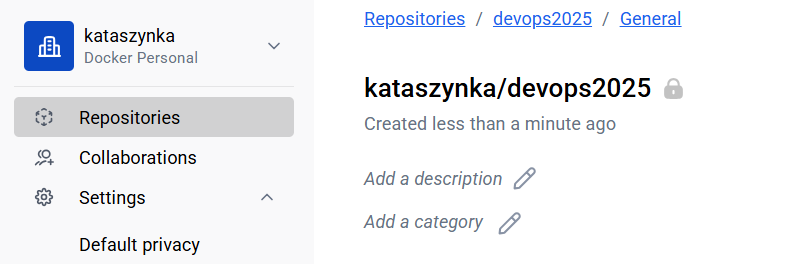
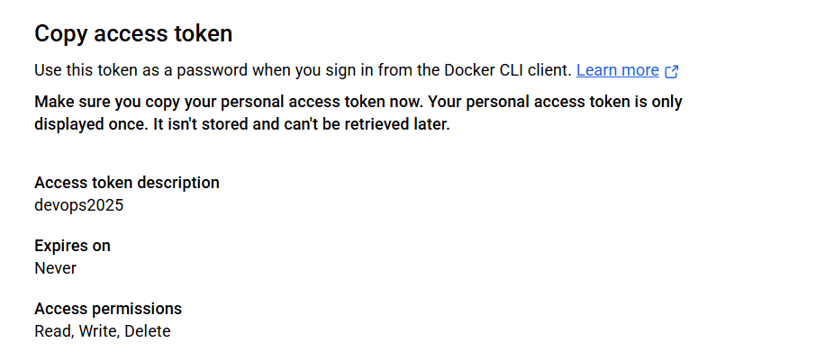

# Git action deployment pipeline - Sprawozdanie

### **1. Aktualizacja repozytorium i utworzenie branchu**

### **2. Utworzenie konta i repozytorium na Docker Hub**




### 3. Utworzenie tokenu dostępowego



Skopiowałam token i zapisałam lokalnie.


### **4. Utworzenie sekretu GitHub**

#### 4.1 Przejście do ustawień repozytorium > Settings > Secrets and variables > Actions

Utworzono dwa sekrety:

* `DOCKER_USERNAME_416645`
* `DOCKER_PASSWORD_416645`


## **Krok 4: Utworzenie środowiska roboczego**

### 4.1 Skopiowanie folderu `env_00000` do nowego folderu

```bash
cp -r env_00000 env_416645
```


## **Krok 5: Konfiguracja GitHub Actions**

### 5.1 Stworzenie pliku `.github/workflows/lab8.yml`

```yaml
name: lab_8_416645

on:
  push:
    branches:
      - Lab8/416645
    
jobs:
  unit_test:
    runs-on: ubuntu-latest
    
    steps:
    - name: Checkout code
      uses: actions/checkout@v2

    - name: Set up Python
      uses: actions/setup-python@v2
      with:
        python-version: '3.11'

    - name: Install libs for testing
      run: |
        pip  install pytest 
    
    - name: prepare environemnt 
      run: |
         cd ./Lab_8/env_416645 && python -m pip install -r requirements.txt
    - name: Run test
      run: |
        cd ./Lab_8/env_416645/main && pytest calculator_test.py
  function_test:
    runs-on: ubuntu-latest
    needs: unit_test
    steps:
      - name: Checkout code
        uses: actions/checkout@v2

      - name: Set up Python
        uses: actions/setup-python@v2
        with:
          python-version: '3.11'

      - name: Install libs for testing
        run: |
          pip install pytest 

      - name: prepare environemnt 
        run: |
           cd ./Lab_8/env_416645 && python -m pip install -r requirements.txt

      - name: Run app
        run: |
          cd ./Lab_8/env_416645/main && nohup python app.py &

      - name: Wait for app to start
        run: |
          sleep 10

      - name: Run test
        run: |
          cd ./Lab_8/env_416645/main && pytest app_test.py
  deployment:
    needs: function_test
    runs-on: ubuntu-latest
    steps:
    - name: Checkout code
      uses: actions/checkout@v2

    - name: Login to DockerHub
      uses: docker/login-action@v1
      with:
        username: ${{ secrets.DOCKER__LOGIN_416645 }}
        password: ${{ secrets.DOCKER_PASSWORD_416645 }}

    - name: Set up Docker Buildx
      uses: docker/setup-buildx-action@v1
      with:
        context: ./Lab_8/env_416645
        file: ./Lab_8/env_416645/dockerfile

    - name: Build and push Docker Image
      uses: docker/build-push-action@v2
      with:
        context: ./Lab_8/env_416645
        file: ./Lab_8/env_416645/dockerfile
        push: true
        tags: ${{ secrets.DOCKER_LOGIN_416645 }}/devops_416645:latest
```


### 5.2 Commit i push zmian

```bash
git add .
git commit -m "Poprawa pliku yml"
git push origin Lab8/416645
```


Aby test przeszedł pomyślnie należało dodać biblioteki do `requirements.txt`.


## **Krok 6: Naprawa błędów w testach funkcjonalnych**

Po nieudanym teście funkcjonalnym naprawiono błędy w plikach `.py`.
Ponowny push uruchomił workflow i zakończył się sukcesem.


## **Krok 7: Testowanie obrazu lokalnie**

Obraz został utworzony na repozytorium Docker.


### 7.1 Logowanie do Docker Huba

```bash
docker login
```


### 7.2 Pobranie i uruchomienie obrazu

```bash
docker pull sonsku/devops_416645
docker run -d -p 5000:5000 sonsku/devops_416645
```


### 7.3 Uruchomienie lokalnych testów

```bash
cd Lab_8/env_416645
pytest function_test.py
```


Wszystkie testy zakończyły się sukcesem.

## **Tematy dodatkowe**

### Dlaczego deployment po testach?

Wdrażanie po testach zapewnia, że do repozytorium trafi jedynie **działający i przetestowany kod**. Zapobiega to publikacji błędnych obrazów.

### Czym różnią się testy funkcjonalne od jednostkowych?

* **Unit testy** sprawdzają pojedyncze funkcje (np. dodawanie).
* **Funkcjonalne** – testują aplikację jako całość, np. pełen request HTTP.

### Dlaczego `RUN pip install -r requirements.txt` w osobnej linii?

Umożliwia **cache'owanie** warstwy z zależnościami – budowa obrazu jest szybsza, jeśli kod się zmieni, ale zależności nie.

### Dlaczego używać sekretów?

Sekrety chronią **wrażliwe dane** (loginy, hasła, tokeny) – nie są widoczne w kodzie i są bezpiecznie szyfrowane przez GitHub Actions.